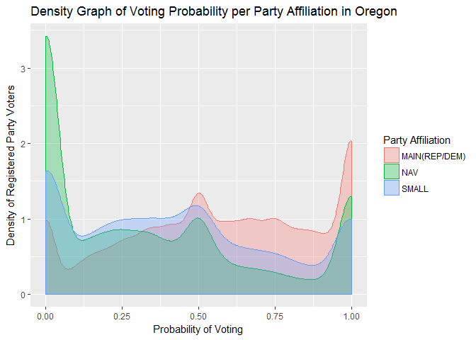

HW\_0\_Dounias
================
TDounias
February 9, 2017

``` r
library(tidyverse) # load the package that has many of the functions we need
vote_particip <- read_csv("http://bit.ly/2l1bIxs")

#Create boolean tables for handling the data

bool_rep <- vote_particip$PARTY_CODE == "REP"
bool_dem <- vote_particip$PARTY_CODE == "DEM"
bool_nav <- vote_particip$PARTY_CODE == "NAV"

#Create copy of original data to change

vote_particip_m <- vote_particip

#Change variable p_code to reflect wanted values

vote_particip_m$PARTY_CODE[bool_rep|bool_dem] <- "MAIN(REP/DEM)"
vote_particip_m$PARTY_CODE[bool_nav] <- "NAV"
vote_particip_m$PARTY_CODE[!(bool_rep|bool_dem|bool_nav)] <- "SMALL"

#Plot graph at 00:23 with another problem set due

ggplot(vote_particip_m, aes(x = p_vote, fill = PARTY_CODE)) +
  geom_density(alpha = .3, aes(col = PARTY_CODE)) +
  labs(x = "Probability of Voting", y = "Density of Registered Party Voters", fill = "Party Affiliation", col = "Party Affiliation") +
  ggtitle("Density Graph of Voting Probability per Party Affiliation in Oregon")
```



``` r
#Softly cry due to bad time managment
```

My motivating question was: "Are voters more or less likely to vote depending on their party affiliation? Specifically, are mainstream party voters more comited to voting than those registered with small parties, or NAVs(Non-Affiliated Voters)?"

In this graph I am using two variables. The categorical variable of party affiliation, which I divided into MAIN(REP/DEM), SMALL, and NAV, and the numerical value of the density of voters for each probability, as in how many voters from each party affiliation vote with probability "X".

I decided to use a density plot, therefore it was self-evident that my x-axis would be given to the variable of who's density I was seeking. I used fill(colour) for each different party so I could create a clear distinguishing difference between values of my categorical variable. The fill aesthetic was used specifically to denote the fact that this is a density graph, implying that the area under the curve is representative of added members of a population.

The density curve geometry I used seemed optimal for two reasons. First, it creates a clear, equal scale between the three party affiliations, despite the majority of the population falling into the MAIN category. Second, it creates a clear way to compare the three groups to each other, by just seeing what amount of the population of each group teds to vote more frequently.

I changed the alpha value of the density plot, and added descriptive labels. The latter is self-explanatory as a move, the former was in order to be able to have all graphs overlap but still be in distinct hierarchy for each x-axis value. This way, it is clear what group tends to have more people voting with a probability higher than 50%, for example, while still not covering up the other two curves.

The answer for my question derived from this graph is that, indeed, people registered with mainstream parties in Oregon tend to vote more than those registered in small parties, who tend to vote more than NAV's, since after the .5 point of the x-axis that ranking is virtually continuous, with a slight change towards the end which might be indicative of first time voters, as described in class.
