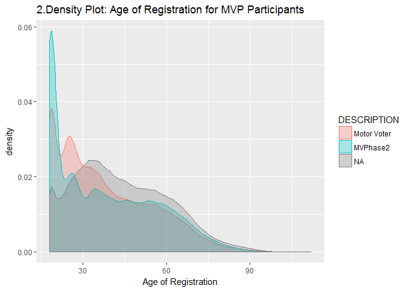
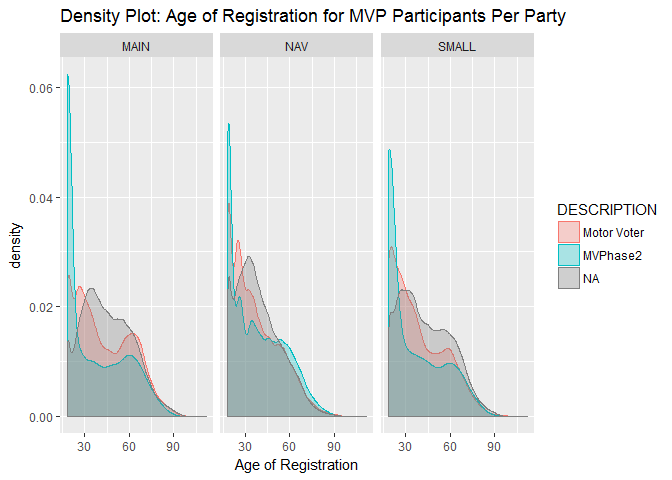

hw\_1\_wrangle
================
TDounias
February 14, 2017

``` r
library(tidyverse)
```

    ## Loading tidyverse: ggplot2
    ## Loading tidyverse: tibble
    ## Loading tidyverse: tidyr
    ## Loading tidyverse: readr
    ## Loading tidyverse: purrr
    ## Loading tidyverse: dplyr

    ## Conflicts with tidy packages ----------------------------------------------

    ## filter(): dplyr, stats
    ## lag():    dplyr, stats

``` r
library(dplyr)
library(lubridate)
```

    ## 
    ## Attaching package: 'lubridate'

    ## The following object is masked from 'package:base':
    ## 
    ##     date

``` r
library(ggplot2)

#Load Data
or_mv <- read_csv("http://bit.ly/2lCadlB")
```

    ## Parsed with column specification:
    ## cols(
    ##   VOTER_ID = col_integer(),
    ##   DESCRIPTION = col_character(),
    ##   COUNTY = col_character()
    ## )

``` r
or_reg <- read_csv("http://bit.ly/2kG37yJ")
```

    ## Parsed with column specification:
    ## cols(
    ##   VOTER_ID = col_integer(),
    ##   BIRTH_DATE = col_character(),
    ##   CONFIDENTIAL = col_character(),
    ##   EFF_REGN_DATE = col_character(),
    ##   STATUS = col_character(),
    ##   PARTY_CODE = col_character(),
    ##   COUNTY = col_character()
    ## )

``` r
#Join data and filter out unnecessary variables
joined_or <- or_reg %>% 
  left_join(or_mv, by = c("VOTER_ID" = "VOTER_ID"))
head(joined_or)
```

    ## # A tibble: 6 × 9
    ##    VOTER_ID BIRTH_DATE CONFIDENTIAL EFF_REGN_DATE STATUS PARTY_CODE
    ##       <int>      <chr>        <chr>         <chr>  <chr>      <chr>
    ## 1 100743763 07-15-1966         <NA>    08-31-2016      A        NAV
    ## 2 100743762 02-17-1965         <NA>    09-20-2016      A        NAV
    ## 3 100783979 04-19-1997         <NA>    12-05-2016      A        DEM
    ## 4 100505034 10-04-1991         <NA>    10-18-2016      A        IND
    ## 5  11905738 01-21-1974         <NA>    05-09-2013      A        DEM
    ## 6  16765525 08-18-1948         <NA>    09-28-2004      A        REP
    ## # ... with 3 more variables: COUNTY.x <chr>, DESCRIPTION <chr>,
    ## #   COUNTY.y <chr>

``` r
joined_or <- joined_or %>% 
  select(1:8)

joined_or <- filter(joined_or, STATUS == "A")

joined_or_cln <- joined_or %>%
  select(-9, -5, -3)

joined_or_cln <- joined_or_cln %>%
  rename(COUNTY = COUNTY.x)

#Format dates
joined_or_cln$BIRTH_DATE <- mdy(joined_or_cln$BIRTH_DATE)
```

    ## Warning: 1189 failed to parse.

``` r
joined_or_cln$EFF_REGN_DATE <- mdy(joined_or_cln$EFF_REGN_DATE)

#Define AGE variable
joined_or_cln <- joined_or_cln %>%
  mutate(AGE = 2017 - year(BIRTH_DATE))

#Define PARTY_SIZE variable
joined_or_cln <- joined_or_cln %>%
  mutate(PARTY_SIZE = ifelse((PARTY_CODE %in% c("DEM", "REP")), "MAIN", "SMALL"))

joined_or_cln$PARTY_SIZE[joined_or_cln$PARTY_CODE == "NAV"] <- "NAV"

#Clear out irregularities in AGE
joined_or_cln <- joined_or_cln %>%
  filter(AGE < 130 & AGE>0)

#Define and purge REGistration_DATE
joined_or_cln <- joined_or_cln %>%
  mutate(AGE_REG = year(EFF_REGN_DATE) - year(BIRTH_DATE))

joined_or_cln <- joined_or_cln %>%
  filter(AGE_REG >= 18 & AGE_REG < 130)

#Plot1
ggplot(joined_or_cln, aes(AGE_REG, fill = PARTY_SIZE)) +
  geom_density(alpha = .3, aes(col = PARTY_SIZE)) +
  labs(title = "1.Density Plot: Registration Age of Voters per Party Size")
```


``` r
#Plot2
ggplot(joined_or_cln, aes(AGE_REG, fill = DESCRIPTION)) +
  geom_density(alpha = .3, aes(col = DESCRIPTION)) +
  labs(title = "2.Density Plot: Age of Registration for MVP Participants", x = "Age of Registration")
```



``` r
#Plot3
ggplot(joined_or_cln, aes(AGE_REG, fill = DESCRIPTION)) +
  geom_density(alpha = .3, aes(col = DESCRIPTION)) +
  labs(title = "Density Plot: Age of Registration for MVP Participants Per Party", x = "Age of Registration") +
  facet_wrap(~PARTY_SIZE)
```



The graphs presented are an answer to the question of the registration age of voters. Specifically, I wanted to examine if there is a trend in the registration age for voters of specific parties according to their size(mainstream/small/NAV) and if MVP participants register at a younger age than other voters and if they follow the same age trend of the general population.

Each graph has two to three variables. The first has the age of registration as continuous and party size as categorical. The second has age of registration and MVP groups, and the third has all three.

I decided to use a density plot, therefore it was self-evident that my x-axis would be given to the variable of who's density I was seeking. I used fill(colour) for each different party or MVP program so I could create a clear distinguishing difference between values of my categorical variable. The fill aesthetic was used specifically to denote the fact that this is a density graph, implying that the area under the curve is representative of added members of a population. The last graph is faceted because my interest is comparison between party sizes. (!Partly copied from previous homework submission, same explanation for use of density plots)

I changed the alpha value of the density plot, and added descriptive labels. The latter is self-explanatory as a move, the former was in order to be able to have all graphs overlap but still be in distinct hierarchy for each x-axis value. (!See above comment)

Strangelly enough, NAV's tend to register to vote at a younger age. This is possibly indicative of a trend of youth disenfranchisment by the larger political parties, or of involvment in politics of a wider array of people not previously involved, that tend to take less party-oriented political stances. The MVP program has been a success especially for younger voters registering. When comparing the success of the NAV over standard voter registration, it is obvious that the MVPhase 2 attracted more mainstream, young party supporters than MVPhase 1, since the program has been in practice for a small amount of years, which means that any people under 30 registered with the MVP would still be at a relativelly young age.
