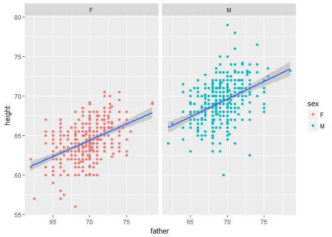
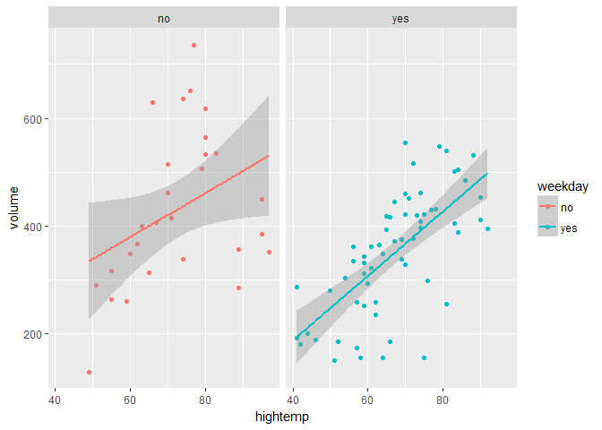
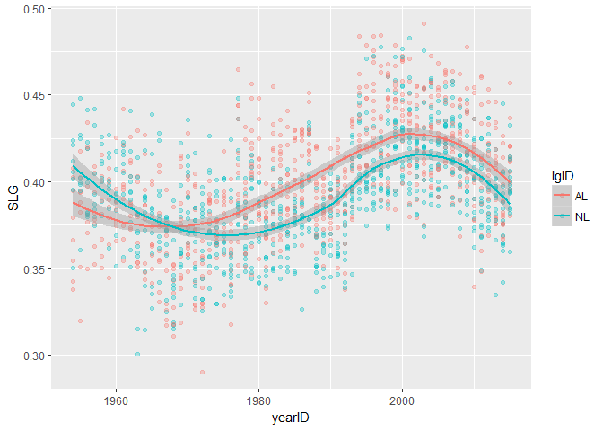

hw\_2\_review
================
Theodore Dounias
February 24, 2017

**Exercise 3.1**

We create the desired graph

``` r
ggplot(Galton, aes(father, height)) +
  geom_point(aes(col = sex)) +
  geom_smooth(method = "lm") +
  facet_wrap(~sex)
```



**Exercise 3.2**

``` r
#Transform RailTrail weekday into more understandable form
RailTrail1 <- RailTrail
bool <- c("no", "yes")
RailTrail1$weekday <- bool[RailTrail$weekday]
#Plot graph
ggplot(RailTrail1, aes(hightemp, volume, col = weekday)) +
  geom_point() +
  geom_smooth(method = "lm") +
  facet_wrap(~weekday)
```



**Exercise 4.8** We create an operational version of Teams, and add two variables using the mutate function:

``` r
Teams_op <- Teams %>%
  mutate(BA = H/AB, SLG = (H + X2B + 2*X3B + 3*HR)/AB)
```

**Exercise 4.9** We first create the appropriatelly wrangled data set and then plot the graph:

``` r
#Wrangle data
Team_4.9 <- Teams_op %>%
  filter(yearID >=1954)
#Graph
ggplot(Team_4.9, aes(x = yearID, y = SLG, col = lgID)) +
  geom_point(alpha = .3) +
  geom_smooth()
```

    ## `geom_smooth()` using method = 'loess'

 It appears that the American League has had typically higher SLG's than the National League. ~~whatever those are~~

**Exercise 4.10** First for MLB history:

``` r
Top_teams <- Teams_op %>%
  group_by(teamID) %>%
  summarize(meanSLG = mean(SLG)) %>%
  arrange(desc(meanSLG)) %>%
  slice(1:15)
Top_teams
```

    ## # A tibble: 15 × 2
    ##    teamID   meanSLG
    ##    <fctr>     <dbl>
    ## 1     COL 0.4425149
    ## 2     ANA 0.4223234
    ## 3     BS1 0.4165024
    ## 4     TOR 0.4164657
    ## 5     MIL 0.4153768
    ## 6     ARI 0.4152269
    ## 7     ML1 0.4135638
    ## 8     TEX 0.4132939
    ## 9     TBA 0.4056308
    ## 10    FLO 0.4051400
    ## 11    NYP 0.4048443
    ## 12    SEA 0.4037377
    ## 13    NYA 0.4031045
    ## 14    LAA 0.4014739
    ## 15    BLN 0.4004644

And for recent history:

``` r
Top_teams_recent <- Teams_op %>%
  filter(yearID >=1969) %>%
  group_by(teamID) %>%
  summarize(meanSLG = mean(SLG)) %>%
  arrange(desc(meanSLG)) %>%
  slice(1:15)
Top_teams_recent
```

    ## # A tibble: 15 × 2
    ##    teamID   meanSLG
    ##    <fctr>     <dbl>
    ## 1     COL 0.4425149
    ## 2     BOS 0.4266100
    ## 3     ANA 0.4223234
    ## 4     NYA 0.4165389
    ## 5     TOR 0.4164657
    ## 6     MIL 0.4153768
    ## 7     ARI 0.4152269
    ## 8     LAA 0.4133163
    ## 9     TEX 0.4132939
    ## 10    DET 0.4110966
    ## 11    BAL 0.4075298
    ## 12    TBA 0.4056308
    ## 13    FLO 0.4051400
    ## 14    CHA 0.4048150
    ## 15    CLE 0.4038089

**Exercise 4.11** Assuming that the world series is the most important thing in baseball, and that success of a season depends on rank, the following gives us the wanted results:

``` r
#Create Dataset
LATeam <- Teams_op %>%
  filter(teamID %in% c("LAA", "CAL", "ANA")) 
#Filter and print for "success" as measured by someone who does not know baseball
LATeam$WSWin <- as.factor(LATeam$WSWin)
LATeam %>%
  select(Rank, yearID, teamID, WSWin) %>%
  arrange(desc(WSWin), Rank) %>%
  slice(1:10)
```

    ##    Rank yearID teamID WSWin
    ## 1     2   2002    ANA     Y
    ## 2     1   1979    CAL     N
    ## 3     1   1982    CAL     N
    ## 4     1   1986    CAL     N
    ## 5     1   2004    ANA     N
    ## 6     1   2005    LAA     N
    ## 7     1   2007    LAA     N
    ## 8     1   2008    LAA     N
    ## 9     1   2009    LAA     N
    ## 10    1   2014    LAA     N
