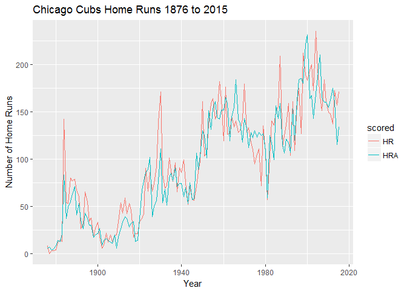

hw\_3\_tidy
================
Theodore Dounias
February 27, 2017

#### PART 1

**Exercise 5.1** First we wrangle the data:

``` r
cubs_hr <- Teams %>%
  filter(teamID == "CHN") %>%
  select(yearID, HR, HRA) %>%
  group_by(yearID) %>%
  summarize(HR = sum(HR), HRA = sum(HRA))
```

Then we tidy the data set into narrow format:

``` r
cubs_hr <- cubs_hr %>% 
  gather(key = scored, value = number, HR, HRA)
```

And finally make our plot:

``` r
ggplot(cubs_hr, aes(x = yearID, y = number)) +
  geom_line(aes(col = scored)) +
  labs(x = "Year", y = "Number of Home Runs", title = "Chicago Cubs Home Runs 1876 to 2015")
```


