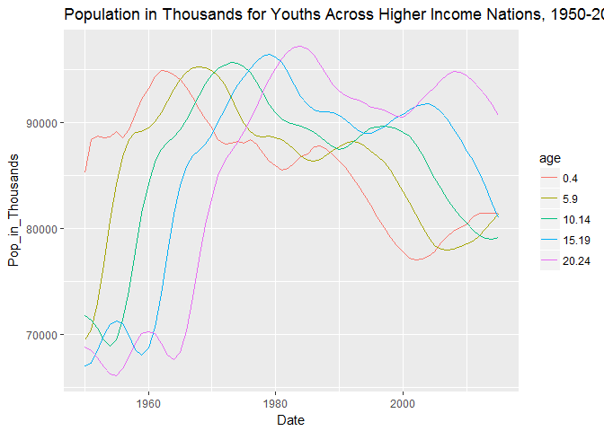
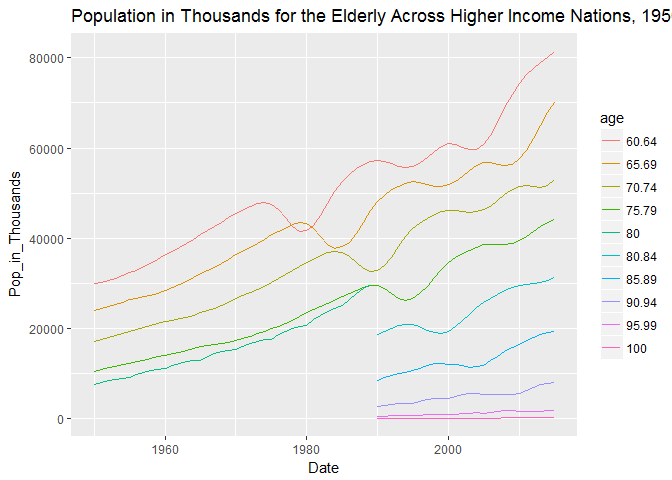
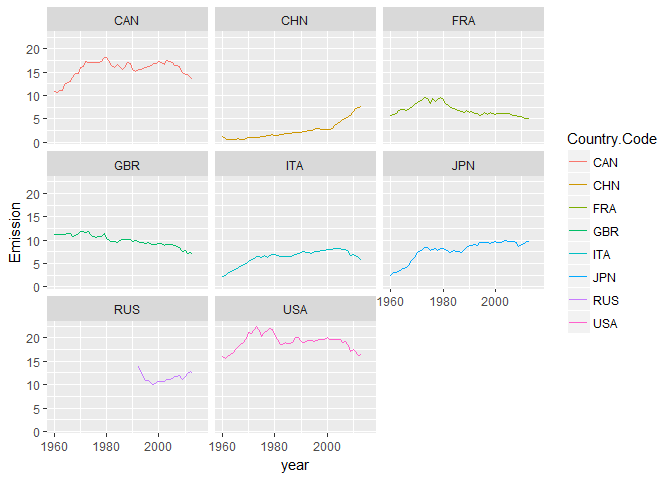
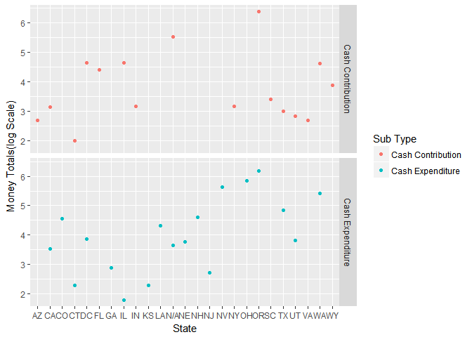

hw\_4\_import
================
Theodore Dounias
March 8, 2017

### DATASET 1

*UNITED NATIONS - Department of Economic and Social Affairs*

Census data by age and countr or country group, in xls format. I wished to create a visualization to shpw how in higher income countries the youth population shows negative trends contrary to the elderly population. For this, I ran the following code:

``` r
#Read the dataset, only for the desired rows since its a very VERY long one
df <- read.xlsx("C:\\Users\\tdounias\\Desktop\\Reed College\\Spring 2017\\MATH 241\\Repositories\\theodore_dounias\\hw_4_import\\data\\pop_by_age.XLS",
                sheetIndex = 1,
                startRow = 17,
                endRow = 743
                )

#Slice further to select only higher income countries
df_rich <- df %>% 
  slice(397:462)

#Tidy the dataset
df_rich <- df_rich %>%
  gather(key = age, value = Pop_in_Thousands, 7:28) %>%
  select(-Notes, -Country.code, -Variant) 
```

    ## Warning: attributes are not identical across measure variables; they will
    ## be dropped

``` r
#Derive numerical values for Age
df_rich$age <- parse_number(df_rich$age)

#Rename from weird format
names(df_rich)[2] <- "Country_Income"
names(df_rich)[3] <- "Date"

#Variables as factors
df_rich$age <- as.factor(df_rich$age)
df_rich$Pop_in_Thousands <- as.integer(df_rich$Pop_in_Thousands)
```

    ## Warning: NAs introduced by coercion

``` r
#Create seperate datasets for old/young
df_rich_young <- df_rich %>%
  filter(age %in% c(0.40, 5.90, 10.14, 15.19, 20.24))

df_rich_old <- df_rich %>%
  slice(793:1452)
  
#Visualize
ggplot(df_rich_young, aes(x = Date, y = Pop_in_Thousands, col = age)) +
  geom_line() +
  labs(title = "Population in Thousands for Youths Across Higher Income Nations, 1950-2015")
```



``` r
ggplot(df_rich_old, aes(x = Date, y = Pop_in_Thousands, col = age)) +
  geom_line() +
  labs(title = "Population in Thousands for the Elderly Across Higher Income Nations, 1950-2015")
```

    ## Warning: Removed 226 rows containing missing values (geom_path).



From the first graph we can see a clear decline in later years in the number of youths in higher income bracket countries. As for the numbers of the elderly, we see the appearance and increase of people older than 80 years of age. However we cannot make a claim on the relative population size, as the increase might be just a product of increased population in general. We would need to create a graph for changes in percentage of total population, which, due to time issues, I was unable to construct here.

### DATASET TWO

*CO2 Emission Data - World Bank*

I wanted to cross reference all the CO2 emission data for the G8 countries.

``` r
#Import the Data
co2_stats <- read.xlsx("C:\\Users\\tdounias\\Desktop\\Reed College\\Spring 2017\\MATH 241\\Repositories\\theodore_dounias\\hw_4_import\\data\\CO2_emissions.xls",
          sheetIndex = 1,
          startRow = 4
          )

#Change type
co2_stats$Country.Code <- as.character(co2_stats$Country.Code)

#Filter and tidy
G8 <- c("RUS", "USA", "GBR", "CHN", "FRA", "CAN", "ITA", "JPN")
co2_stats <- co2_stats %>%
  filter(co2_stats$Country.Code %in% G8) %>%
  gather(key = year, value = Emission, 5:61)

#Make year a numerical variable
co2_stats$year <- parse_number(co2_stats$year)

#Make final plot
ggplot(co2_stats, aes(x = year, y = Emission, col = Country.Code)) +
  geom_line() +
  facet_wrap(~Country.Code)
```

    ## Warning: Removed 56 rows containing missing values (geom_path).



This is a handy cross tabulation of the data, with uses for quickly calculating how much each country emits.

DATASET THREE
-------------

*OreStar data for spending: Dennis Richardson for SecState Oregon*

For the third dataset, I was interested in looking at an individual candidate and their spending patterns, in order to search for abnormalities. I concluded that a good place to star, especially for a state and not federal position, was to check how much money the candidate's campaign spent and received from other states, in order to then have someone reasearch any abnormal patterns for possible issues. I chose Republican Secretary of State Dennis Richardson. The code is explained within:

``` r
library(readxl)
secstate_fin <- read_excel("C:\\Users\\tdounias\\Desktop\\Reed College\\Spring 2017\\MATH 241\\Repositories\\theodore_dounias\\hw_4_import\\data\\secstate_finance_oregon.xls",
                 sheet = 1)

#Tidy the money amounts
secstate_df <- secstate_fin %>%
  gather(key = "Type of Amount", value = "Amount", Amount, `Aggregate Amount`) %>%
  select(-40, -48, -47, -15, -16, -18)

#Tidy the employment status of the donor/receiver of the money
secstate_df <- secstate_df %>%
  mutate(`Employer Key` = ifelse(`Employ Ind` == "Y", "Employ Ind", 
                                 ifelse(`Self Employ Ind` == "Y", "Self Employ Ind",
                                        ifelse(`Emp State` == "NA", NA, "Traditionally Employed")))) %>%
  select(-28, -27)

#Create second dataframe for vizualizing. Here I want to filter and summarize for each state, and within that for each
#type of exchange--contribution or expenditure
secstate_viz <- secstate_df %>%
  filter(`Sub Type` %in% c("Cash Expenditure", "Cash Contribution")) %>%
  filter(`Type of Amount` == "Amount") %>%
  group_by(`State`, `Sub Type`) %>%
  summarize(totals = sum(Amount))

#Rename NA values into NA == No Data Available
secstate_viz[33:34, 1] <- "N/A"

#Plot
ggplot(secstate_viz, aes(x = `State`, y = log10(totals), col = `Sub Type`)) +
  geom_point() +
  facet_grid(`Sub Type`~.) +
  labs(y = "Money Totals(log Scale)", labs = "Spending by State for Oregon SecState Richardson's Campaign")
```



Based on this graph, most of the candidate's spending and expenditures were in Oregon. However, higher monetary exchanges in Nevada and Ohio, as well as any in the N/A category might merit further investigation. For this we might individually check each transaction in those states, check on who the donor/receiver is, see if they are former Oregon citizens, interested partes, Party executives etc.
